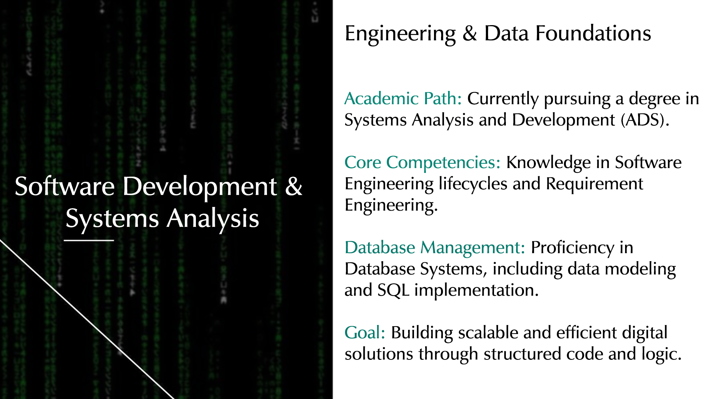
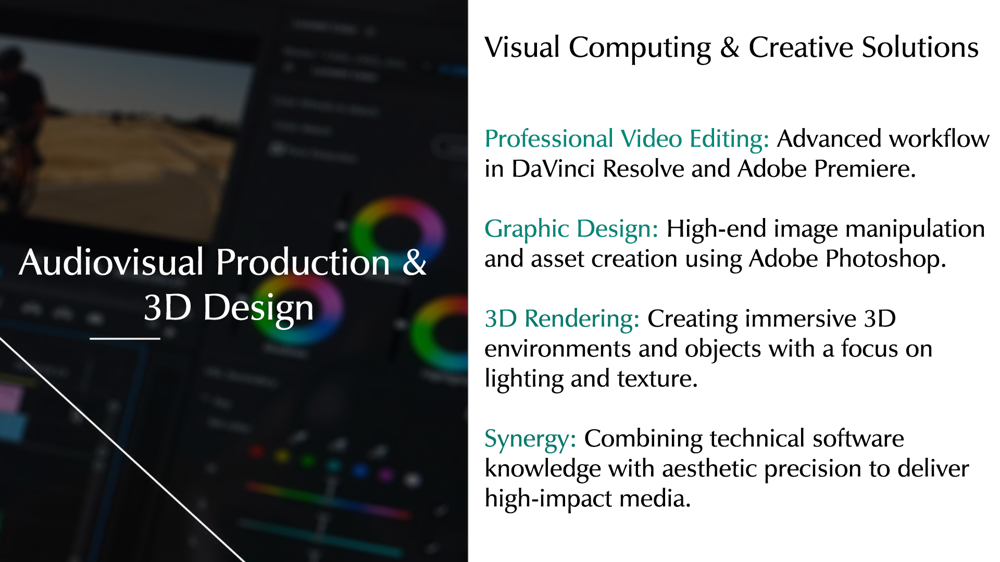
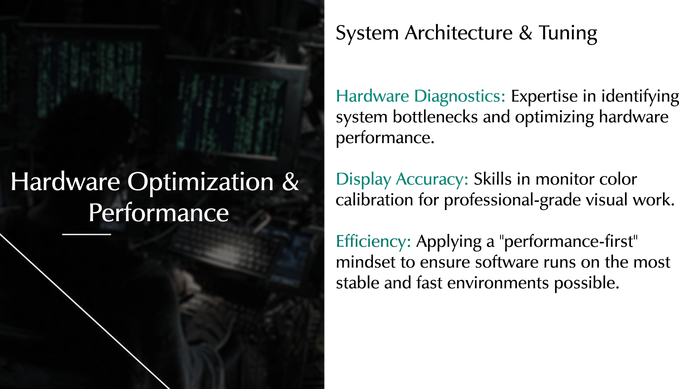
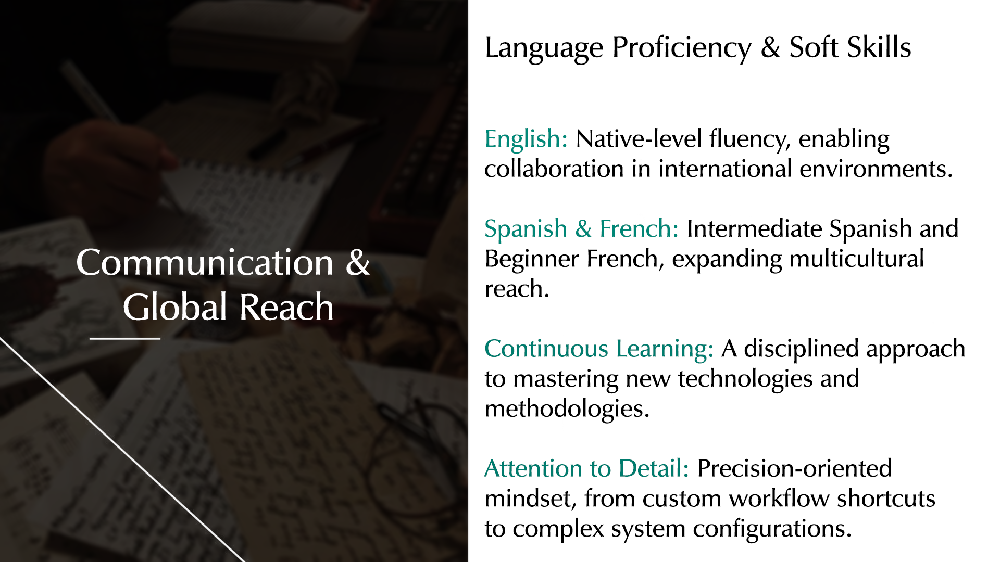

# Personal Profile / About Me 
> Systems Analysis and Development student with a focus on Software Engineering and Database Systems. I combine technical expertise in hardware optimization and systems performance with a creative background in 3D rendering and professional video editing. Fluent in English, with a strong commitment to technical excellence and efficient workflows.
* **LinkedIn:** https://www.linkedin.com/in/othiagoo/
*  **E-mail:** thiagoantos@gmail.com

# Technical Skills & Tools 
* **Development:** Systems Analysis, Software Engineering (CPRE-FL candidate), and Database Management.
* **Video & Photo Editing:** Expert in **DaVinci Resolve**, **Adobe Premiere**, and **Photoshop**.
* **3D & Design:** 3D rendering and visual composition.
* **Languages:** English (Fluent), Spanish (Intermediate), French (Beginner).

# Projects 
* **Hardware Performance Guide:** Technical documentation for i7 12th gen power limit and thermal adjustments.
* **Audiovisual Showreel:** Selected works showcasing advanced editing techniques and color grading.
* **Database Modeling:** Entity-Relationship diagrams and SQL projects developed during the ADS course.
* **Student Grade Calculator (Python):** A script developed to calculate weighted averages and determine student status. 
  [View Code Here](https://github.com/oThiagoDSS/portfolioHUB/blob/main/media_aluno_grade.py)
  

# Skills & Competencies (Visual Presentation)

